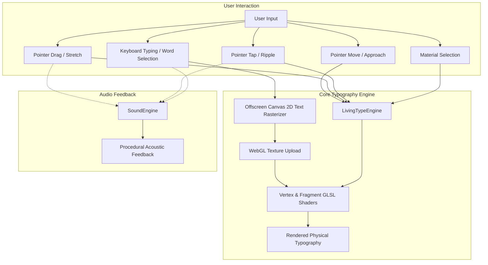

# Living Type

## Technologies Used

- **React 19**: Declarative user interface, state management, and component architecture.
- **Vite 6**: Fast build tooling, bundling, and hot module replacement.
- **WebGL & Custom GLSL Shaders**: GPU-accelerated viscoelastic typography displacement, dynamic chromatic dispersion, and surface sheen rendering.
- **HTML5 Canvas 2D API**: High-resolution rasterization, offscreen texture generation, and real-time alpha mapping.
- **Web Audio API**: Procedural acoustic resonance and physical feedback synthesis.
- **Modern CSS**: Fluid typography, editorial layout architecture, and responsive styling.

---

## Flow Diagram



---

## How to Run

### Prerequisites
- Node.js (version 18 or higher)
- npm, pnpm, or yarn

### Installation
```bash
npm install
```

### Development Server
```bash
npm run dev
```
Open [http://localhost:5173](http://localhost:5173) in your browser.

### Production Build
```bash
npm run build
```

### Preview Build
```bash
npm run preview
```
