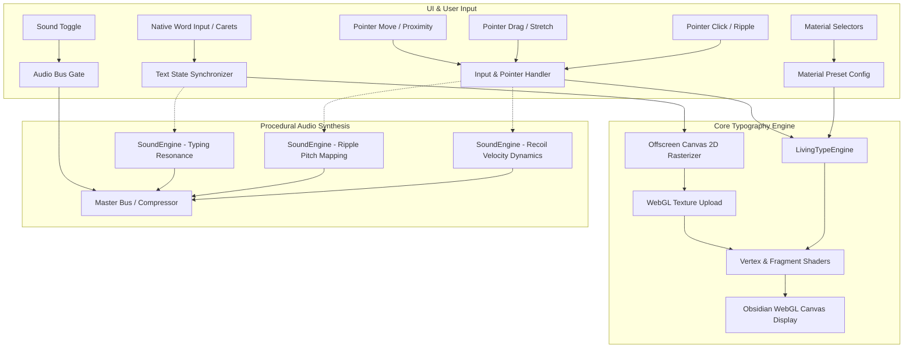

# Living Type

> An experiment in physical typography.

**Living Type** is an interactive, GPU-accelerated visual experiment that treats typography as a responsive physical material. Letters stretch, recoil, deform, and ripple under cursor forces, keyboard input, and material physics on a minimal obsidian canvas.

- **Live Demo**: [https://arpitaa26.github.io/living-type/](https://arpitaa26.github.io/living-type/)
- **Repository**: [https://github.com/Arpitaa26/living-type](https://github.com/Arpitaa26/living-type)

---

## Key Interactions

- **Cursor Approach & Presence**: Letters subtly deform away from or follow the cursor's proximity field using continuous viscoelastic velocity interpolation.
- **Drag & Elastic Stretch**: Clicking and dragging deforms typography along the drag vector. Releasing snaps the text back with material-dependent damped oscillation.
- **Shockwave Ripples**: Clicking or tapping creates multi-ring dispersion ripples across the canvas surface.
- **Native Custom Word Editing**: The top editorial input allows full text editing with precise caret navigation:
  - In-place caret placement between any characters
  - Standard keys: `Backspace`, `Delete`, `ArrowLeft`, `ArrowRight`, `Home`, `End`
  - Range selection with `Shift + Arrow` and clipboard operations (`Ctrl/Cmd + A, C, V`)
  - Calm empty-state handling (clears gracefully without crashing or forced resets)
  - 14-character limit to preserve typographic scale and composition
- **Procedural Acoustic Piano Feedback**:
  - Web Audio API physical modeling with hammer transients, dual detuned string oscillators, and warm soundboard filtering
  - Pitches map to typed characters and ripple positions
  - Velocity-sensitive drag release acoustics
  - Voice rate-limiting to prevent audio clutter
  - Minimal editorial `SOUND ON` / `SOUND OFF` toggle (muted by default)

---

## Physical Material Behaviors

Users can switch between three distinct physical material presets:

| Material | Description | Physics Profile |
|---|---|---|
| **Silicone** | Balanced viscoelastic response with moderate elasticity and smooth dampening. | High cohesion, medium drag resistance, balanced ripple frequency |
| **Fluid Gel** | High viscosity and delayed fluid recovery with wide, lingering shockwaves. | High drag displacement, low stiffness, wide ripple dispersion |
| **Tension** | Tight, snappy restitution with rapid oscillation and sharp localized ripples. | High spring constant, fast recoil velocity, tight wave ripple |

---

## Architecture & Flow



---

## Technologies Used

- **React 19**: Declarative state management, clean component hierarchy, and DOM input synchronization.
- **WebGL & Custom GLSL Shaders**: GPU-accelerated real-time displacement, chromatic dispersion, and surface sheen.
- **HTML5 Canvas 2D API**: High-resolution offscreen text rasterization and dynamic alpha texture generation.
- **Web Audio API**: Procedural physical modeling synthesis (hammer noise transients, detuned biquad soundboard filtering).
- **Vite 6**: Fast module bundler and development environment.
- **Modern CSS**: Minimal editorial design system, typography tokens, and responsive layouts.

---

## Getting Started

### Prerequisites
- [Node.js](https://nodejs.org/) (version 18 or higher)
- npm, pnpm, or yarn

### Installation
```bash
git clone https://github.com/Arpitaa26/living-type.git
cd living-type
npm install
```

### Run Locally
```bash
npm run dev
```
Open [http://localhost:5173](http://localhost:5173) in your browser.

### Production Build
```bash
npm run build
```

### Preview Production Build
```bash
npm run preview
```

### Deploy to GitHub Pages
```bash
npm run build
npx gh-pages -d dist
```
